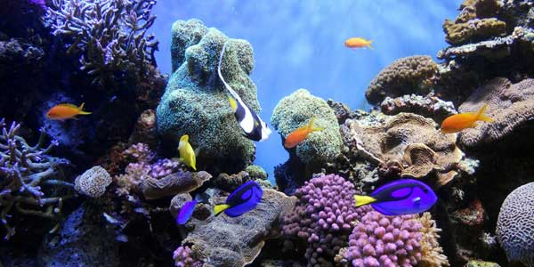

<!DOCTYPE html>
<html lang="en">
  <head>
    <meta charset="UTF-8" />
    <title>Web Images</title>
  </head>

  <body>

   <h1>Web Images</h1>

   
Original Image: 1.9MB

   
   
Low quality (12%). File size: 23.22K 

   
   
Medium quality (30%). File size: 37.5K 

       
    
High quality (60%). File size: 73.28K 

  
   
Very quality (80%). File size: 122.3K 

  
   
Maximum quality (100%). File size: 244.6K 

  </body>
</html>
